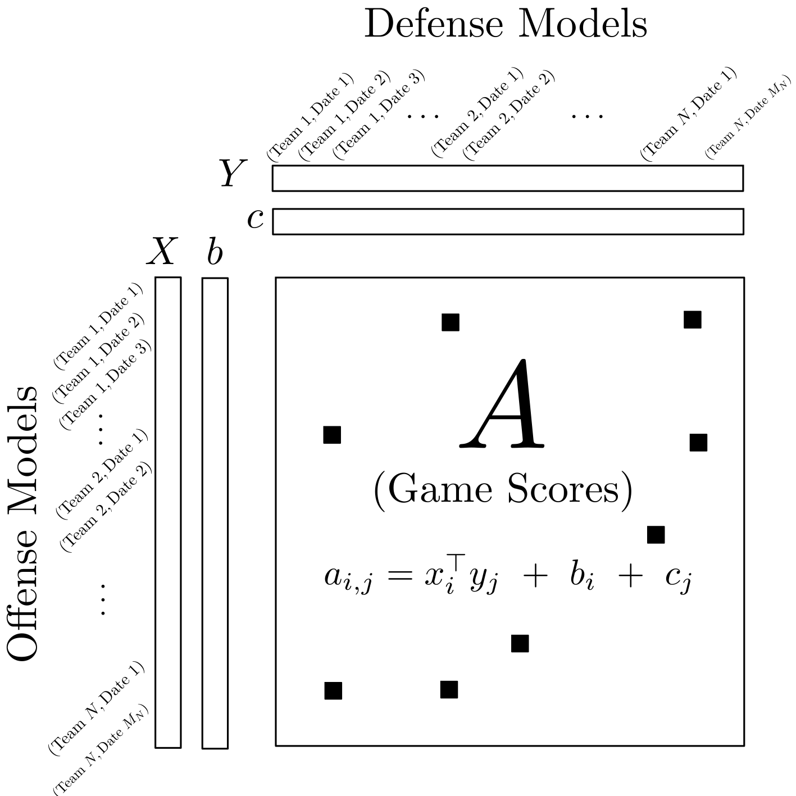

# Bracketology.jl

Yet another computer scientist/statistician building a model for NCAA basketball 🏀🏀🏀

This repository contains code for:
1. Fitting a statistical model to game data.
2. Predicting the outcomes of future games (and assigning probabilities to those outcomes).
3. Filling a most-probable bracket based on the model's inferences.

Of course, this code could be used for sports or games other than basketball.

## Model

We currently use matrix factorization to model teams' game scores.

Imagine a giant matrix **A**:
* Each row represents a team on a particular date
* Each column represents a team on a particular date
* Entry (i,j) represents team i's score against team j on the corresponding date.

The matrix **A** is extremely sparse. In fact, each row and each column contain only one observed entry.
It's empty otherwise.

Our model supposes **A** is generated from four much smaller arrays, **X, b, Y,** and **c**.
* **X** and **b** model *offensive* ability
* **Y** and **c** model *defensive* ability.

Entry (i,j) is generated by *multiplying* **X** and **Y**, and *adding* **b** and **c**. 

See the graphic below for illustration.

  

We **regularize** the entries of **X, b, Y, c** such that
* Entries belonging to the same team, but on different dates, are encouraged to be similar to each other.
* This encouragement is stronger when dates are near in time, and weaker when dates are distant in time.
* These assumptions basically amount to Gaussian process priors on **X, b, Y,** and **c**.

I rely on my own [SparseMatFac.jl](https://github.com/dpmerrell/SparseMatFac.jl) Julia package for model implementation.

You can think of this as a fancier version of the classic [Elo rating](https://en.wikipedia.org/wiki/Elo_rating_system) used in chess and sports. It differs in that the model represents each team with a multi-dimensional parameter, rather than by a single parameter (the Elo rating). It also allows a team's parameter to vary over time. Lastly, the gradient-based procedure for estimating parameters shares information forward and backward in time, in order to make best use of available data. 

## Data

The only data we need are final scores of games from recent years.

Future versions of the model may account for (team,game)-specific covariates: home/away status, team-level quantities, etc.

Data sources:

* NCAA Basketball data were scraped from [Bart Torvik's website](https://barttorvik.com/gamestat.php).
* NCAA Football data were downloaded from [collegefootballdata.com](https://collegefootballdata.com/exporter/games) (this is one of the better sports data websites I've seen&mdash;others should follow their example).
* NFL Football data were scraped from [The Football Database](https://www.footballdb.com/games/index.html).

## Results

A bracket predicted from the `games_19-22.tsv` data can be found in `scripts/filled_bracket.csv`. Alternatively, see it in [Google Sheets](https://docs.google.com/spreadsheets/d/1V59gH4-CDqSBj4xKBC4ClzewRVO1hap4pQ00M74tS8Y/edit?usp=sharing).

It got an ESPN score of 1530 for the 2022 March Madness. (For reference, max ESPN score is 1920 and the top bracket got 1710.)

I'm working on a more rigorous evaluation. This should include measuring accuracy on held-out data and comparisons against simpler baselines (e.g., based on seed).

